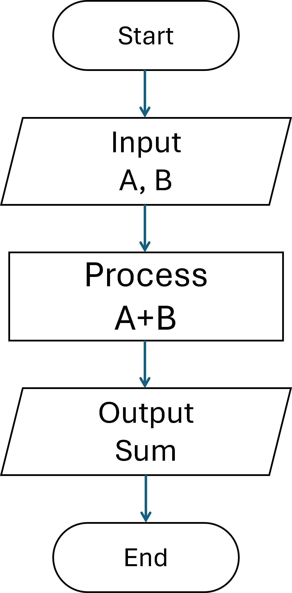

# Module 1: Introduction to Python

## Goal and Objectives

### Goal
The goal of this module is to introduce you to the basics of Python programming. By the end of this module, you will have a foundational understanding of programming concepts, Python syntax, and how to write and run simple Python programs.

### Objectives
- Understand what programming is and why it is important.
- Learn key programming concepts such as algorithms, flowcharts, and debugging.
- Get familiar with Python as a programming language and its various use cases.
- Set up a Python development environment.
- Write and run your first Python program.
- Understand basic Python syntax and how to write comments and docstrings.
- Learn how to run Python code interactively and as scripts.

## Introduction to Programming

### What is Programming?

Programming is the process of creating a set of instructions that tell a computer how to perform a specific task. These instructions are written in a programming language, which is a formal language comprising a set of commands and syntax that can be interpreted or compiled into executable code by a computer.

#### Key Concepts in Programming:

1. **Algorithms**:

   - An algorithm is a step-by-step procedure or formula for solving a problem. It is a sequence of instructions that are followed to achieve a particular goal.
   - Example: A recipe for baking a cake is an algorithm. It provides a series of steps that need to be followed to bake the cake.
   - Example: Addition of Two Numbers
        1. **Start**: Begin the process.
        2. **Input**: Read two numbers, `A` and `B`.
        3. **Process**: Calculate the sum of `A` and `B` and store it in `Sum`.
        4. **Output**: Display the value of `Sum`.
        5. **End**: End the process.
2. **Flowcharts**:

   - Flowcharts are a visual representation of the sequence of steps and decisions needed to perform a process. They use symbols like ovals, rectangles, diamonds, and parallelograms to represent different types of actions or steps in a process.
   - Example: flowchart for addition of two numbers.
   
   
3. **Programming Languages**:

   - Programming languages are used to write algorithms in a form that a computer can understand and execute.
   - Examples of popular programming languages include Python, Java, C++, JavaScript, and Ruby.
4. **Code**:

   - Code refers to the written instructions in a programming language that make up a program.
   - Example: In Python, the code `print("Hello, World!")` instructs the computer to display the text "Hello, World!" on the screen.
5. **Compilation and Interpretation**:

   - **Compiled Languages**: The code is translated into machine language by a compiler before it is executed by the computer. Examples include C and C++.
   - **Interpreted Languages**: The code is executed line-by-line by an interpreter at runtime. Examples include Python and JavaScript.
6. **Debugging**:

   - Debugging is the process of finding and fixing errors or bugs in the code. It is an essential part of programming to ensure that the program runs correctly and efficiently.

#### Why Learn Programming?

- **Problem-Solving Skills**: Programming enhances your problem-solving skills by teaching you how to break down complex problems into manageable steps.
- **Career Opportunities**: There is a high demand for skilled programmers in various industries, including technology, finance, healthcare, and more.
- **Automation**: Programming allows you to automate repetitive tasks, saving time and increasing efficiency.
- **Creativity**: Programming enables you to create your own applications, games, websites, and more, bringing your ideas to life.
- **Logical Thinking**: Programming helps develop logical thinking and reasoning skills, which are valuable in many aspects of life and work.
- **Collaboration**: Many programming projects require teamwork, helping you develop collaboration and communication skills.
- **Continuous Learning**: The field of programming is constantly evolving, providing opportunities for continuous learning and professional growth.
- **High Earning Potential**: Skilled programmers often have high earning potential, with competitive salaries and benefits.
- **Global Opportunities**: Programming skills are in demand worldwide, offering opportunities to work in different countries and cultures.
- **Empowerment**: Learning to program empowers you to understand and control technology, making you more self-sufficient and capable of solving technical problems.

#### Getting Started with Programming:

1. **Choose a Programming Language**: Start with a beginner-friendly language like Python, which has a simple syntax and a large community of learners and developers.
2. **Set Up Your Development Environment**: Install the necessary software and tools to write and run your code. For Python, you can use IDLE, VS Code, or Jupyter Notebook.
3. **Write Your First Program**: Begin with a simple program, such as printing "Hello, World!" to the screen, to get a feel for the language and its syntax.
4. **Practice Regularly**: Consistent practice is key to becoming proficient in programming. Work on small projects and gradually take on more complex challenges.

By understanding the basics of programming and practicing regularly, you can develop the skills needed to create your own software applications and solve real-world problems.

### Why Python?

Python is a versatile and widely-used programming language known for its simplicity and readability. It is used in various fields such as web development, data science, artificial intelligence, scientific computing, and more. Some real-world examples of Python use cases include:

- Web development (e.g., Django, Flask)
- Data analysis and visualization (e.g., Pandas, Matplotlib)
- Machine learning and artificial intelligence (e.g., TensorFlow, Scikit-learn)
- Automation and scripting
- Cybersecurity (e.g., penetration testing, network security)
- Game development (e.g., Pygame, Unity with Python)
- Internet of Things (IoT) (e.g., Raspberry Pi, MicroPython)
- Scientific computing (e.g., SciPy, NumPy)
- Natural language processing (e.g., NLTK, SpaCy)

### Installing Python and Setting Up the Environment

To start programming in Python, you need to install Python on your computer and set up a development environment. Here are the steps:

1. **Download and Install Python**:

   - Visit the [official Python website](https://www.python.org/downloads/) and download the latest version of Python.
   - Follow the installation instructions for your operating system.
2. **Set Up the Development Environment**:

    - **IDLE**: [Python's Integrated Development and Learning Environment](https://docs.python.org/3/library/idle.html), which comes bundled with Python.
    - **VS Code**: [A powerful code editor with Python support](https://code.visualstudio.com/). Download it from [here](https://code.visualstudio.com/).
    - **Jupyter**: [An interactive notebook environment for Python](https://jupyter.org/). Install it using the command: `pip install jupyter`.

### Writing Your First Python Program: `Hello, World!`

Let's write and run your first Python program. Open your preferred development environment and type the following code:

```python
print("Hello, World!")
```

Save the file with a `.py` extension (e.g., `hello_world.py`) and run it to see the output.

## Basic Syntax and Comments

### Understanding Python Syntax

Python syntax is designed to be readable and straightforward. Here are some key points:

- Python uses indentation to define blocks of code.
- Statements end with a newline, not a semicolon.
- Variables do not need explicit declaration.

### Writing Comments and Docstrings

Comments and docstrings are used to explain and document your code. They are ignored by the Python interpreter.

- **Single-line comments**: Use the `#` symbol.
  ```python
  # This is a single-line comment
  print("Hello, World!")  # This is an inline comment
  ```
- **Multi-line comments**: Use triple quotes.
  ```python
  """
  This is a multi-line comment
  or docstring.
  """
  ```

## Running Python Code Interactively vs. Running Scripts

You can run Python code in two main ways:

### Interactively:

- Open a Python shell by typing `python` or `python3` in your terminal.
- Type and execute Python commands directly.

### Running Scripts:

- Save your Python code in a `.py` file.
- Run the script by typing `python filename.py` in your terminal.
